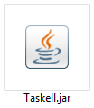
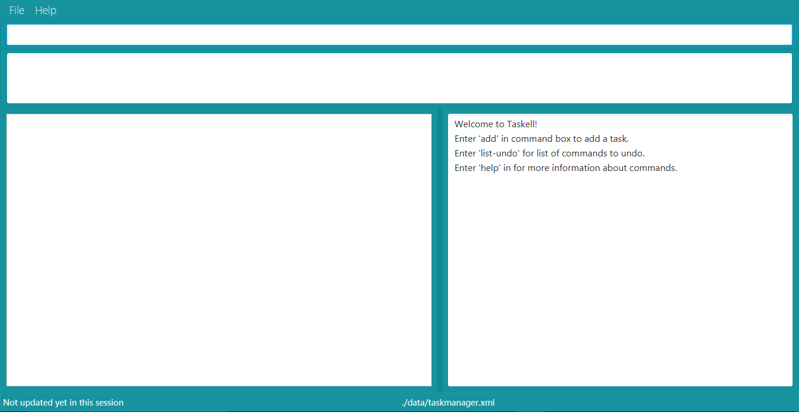
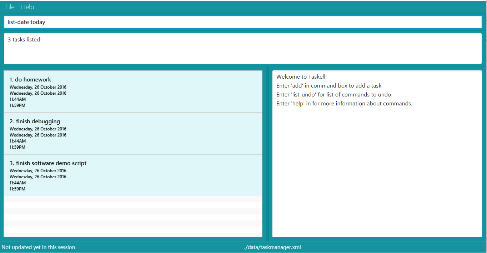
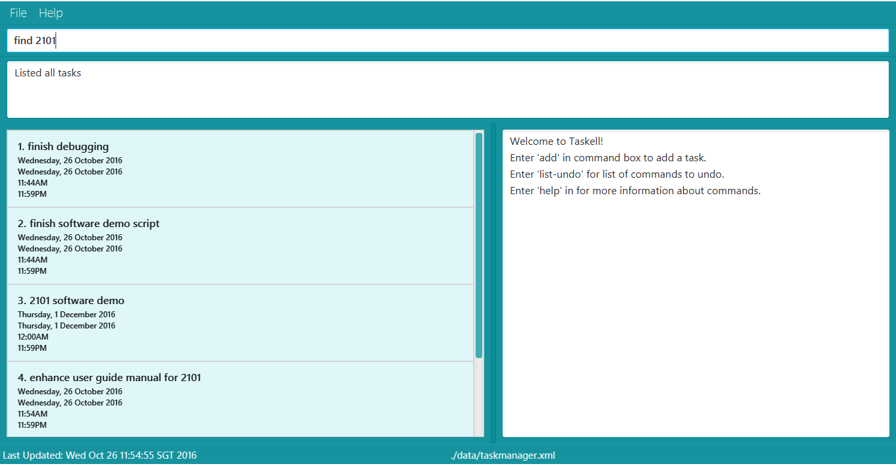
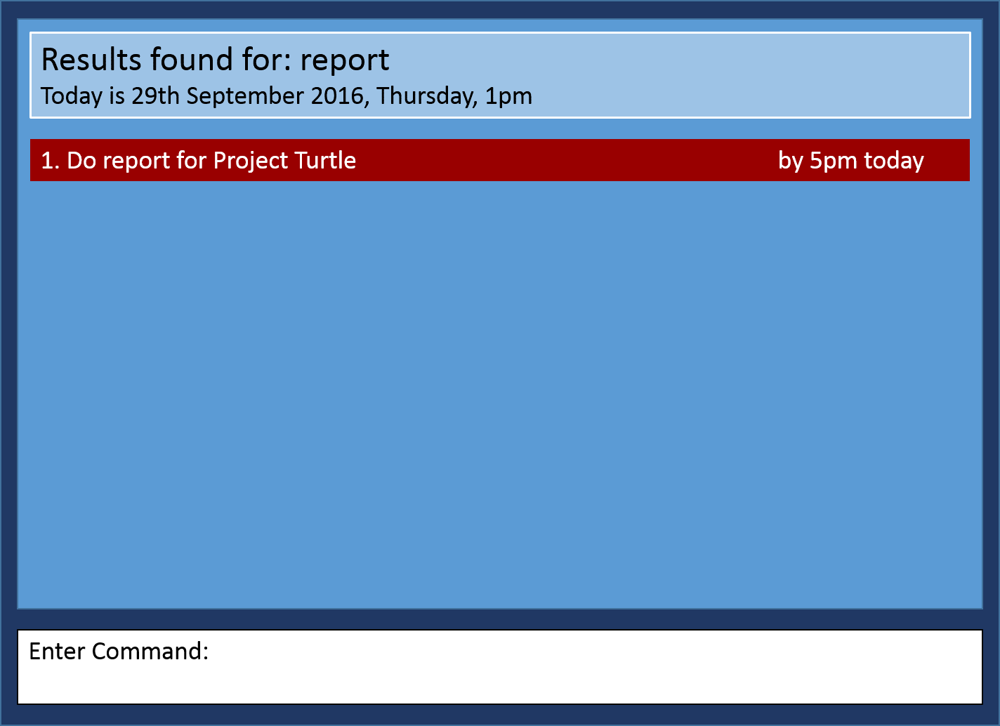
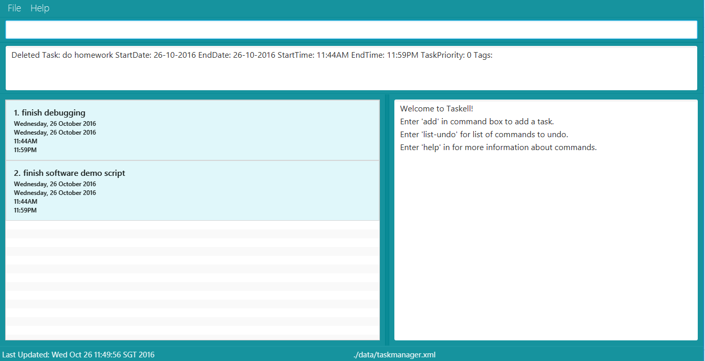
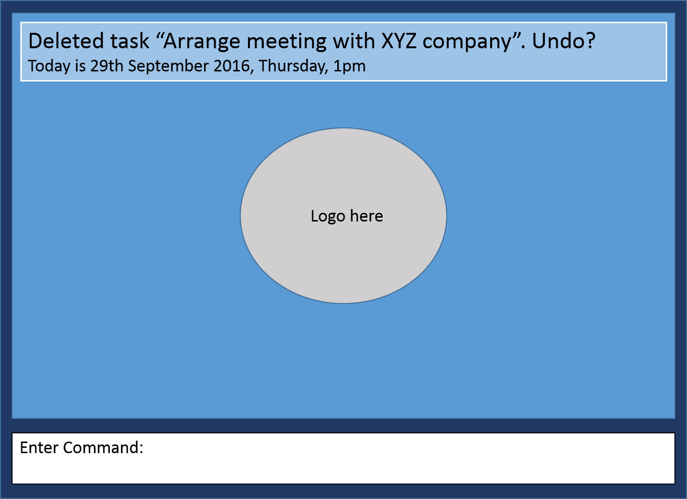
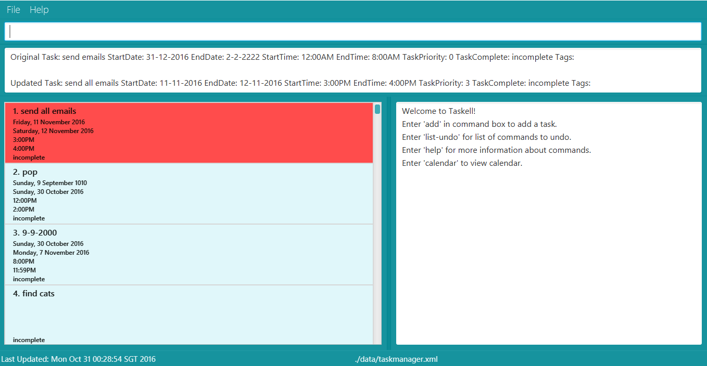

# User Guide
* [Quick Start](#quick-start)
* [Features](#features)
* [FAQ](#faq)
* [Command Summary](#command-summary)

## Quick Start

Step 1: Ensure you have Java version `1.8.0_60` or later installed in your Computer. 

  > Having any Java 8 version is not enough.  
    This application will not work with earlier versions of Java 8.

Step 2: Download the latest `taskell.jar` from <a href="https://github.com/CS2103AUG2016-W15-C3/main/releases">here</a>. 
	   
Step 3: Copy the file to the folder you want to use as the home folder for your Task Manager. 
Step 4: Double-click the file to start the application. The GUI should appear in a few seconds.  
   
&nbsp;&nbsp;&nbsp;&nbsp;Diagram 1: A screenshot of the Graphical User Interface (GUI) 
 Step 5:	Type the relevant command in the command box and press <kbd>Enter</kbd> to execute it. 
Step 6: Some example commands you can try: 
   * **`list`** : displays all contacts
   * **`add`** buy MA1101R textbook today : adds a task called buy MA1101R textbook to be done by today.
   * **`delete`** 3 : deletes the 3rd task shown in the current list
   * **`exit`** : exits the application  
Refer to the [Features](#features) section below for details of each command. 

## Features

This section shows the different commands that you can use in Taskell. Words that are in UPPER_CASE are parameters. These parameters have to be in the order stated below. Words that are in italics are used to identify the parameters while words enclosed in SQUARE_BRACKETS are optional. INDEX refers to the index number shown in the most recent listing.

#### Viewing list of commands : `help`

Type help and pressing <kbd>Enter</kbd> to open the help window. If you enter an incorrect command, eg. happy, the instruction for using each command will be displayed as well. 
 Format: `help`
 
#### Adding a task: `add`
To add a new task to Taskell, use the add command. 

Formats: 
- `add` TASK ITEM  
This format can be used to add floating tasks without any deadlines. 
> Example: `add` read Harry Potter Book  
- `add` TASK ITEM <strong>by</strong> [DATE]  
- `add` TASK ITEM <strong>by</strong> [TIME]  
These 2 formats can be used to add events held on a certain day or time. 
> Example: `add` buy MA1101R textbook <strong>by</strong> today  
> Example: `add` do CS2100 assignment <strong>by</strong> 10th-August 
> Example: `add` go shopping <strong>by</strong> 3pm 
- `add `TASK ITEM <strong>by</strong> [DATE][TIME]  
This format can be used to add tasks with a stipulated deadline. 
> Example: `add` do lab homework <strong>by</strong> Friday.7pm  
-  `add` TASK ITEM <strong>on</strong> [DATE]  
The use of word <strong>"on"</strong> gives more flexibility for you. 
> Example: `add` schedule meeting <strong>on</strong> Thursday  
- `add` TASK ITEM <strong>on</strong> [DATE][TIME]  
> Example: `add` meet teacher <strong>on</strong> 28-09-16 7pm  

Supported Date Format |   Example  
-------- | :-------- 
DD-MM-YY |1-1-16 
DD-MM-YY  | 1-1-2016 
DD-MM-YY  | 1-Jan-2016
DD-MM-YY  | 1-January-2016  
DD-MM-YY  | 1.Jan.2016
DD-MM-YY  | 1.January.2016  
MM-YY  | july-16
MM  | july
day  | today
day  | tdy
day  | tmr
day  | tomorrow
day  | thursday

Supported Time Format |   Example  
-------- | :-------- 
12hour |1pm
12hour |12am
12hour |111.45pm

#### Listing all tasks : `list`
To view a list of all the tasks, <kbd>Enter</kbd> list. 
 
Formats: 
- `list`  
Prints a list of all the uncompleted tasks. 
- `list` DATE   
Prints a list of all the tasks due on the specific date. 
- `list` DONE  
Prints a list of all the completed tasks. 
  
Diagram 2: List of tasks due today printed when `list` today is keyed in.
   
#### Finding tasks: `find`
To view tasks with similar keyword, use the find command. 
Formats:  
-`find` KEYWORD [MORE_KEYWORDS] 
Prints a list of activities that match the keywords. 
Example: `find` banana milk essay: 
This returns any task description having keywords banana, milk, essay.  
-`find-tag` KEYWORD  
Prints list of activities with the same tag. 
   
   

Diagram 3 and 4: Keying in `find` report displays list of tasks with report as one of the keywords in task description

> Take Note!  
> * The order of the keywords does not matter. e.g. `chicken egg` will match `egg chicken`.
> * Partial words will be matched e.g. `chicken` will match `chickens`.
> * Tasks matching at least one keyword will be returned (i.e. `OR` search).
    e.g. `chicken` will match `chicken duck`

#### Reverting previous action : `undo`
If you wish to undo your previous action, <kbd>Enter</kbd> `undo`. 
> Take Note!  
> You are only allowed to undo the last 1 command.
Format: `undo`

#### Deleting a task : `delete`
To delete a task, use the `delete` command. This command deletes the task at a specified INDEX. The index refers to the index number shown in the most recent listing. 
Format: `delete` INDEX 
   
   
Diagram 5 and 6: Entering `delete` 1 will delete "Arrange meeting with XYZ company". 

Example: `find` violin, then `delete` 1 
This deletes the 1st task in the results of the find command.

#### Marking a task as completed: `done`
To mark a task as done, use the `done` command. This command removes the task from uncompleted list and adds to completed tasks. 
Format: `done` INDEX 

Example: `done` 1 
This adds the 1st task as completed. 

#### Editing a task : 
`edit`
To edit a task, use the `edit` command. This command edits the task at a specified INDEX. The index refers to the index number shown in the most recent listing. 
Format: `edit` INDEX NEWTASK 
     
Diagram 7: `edit` 2 schedule meeting on wednesday: edits the 2nd task in Taskell to "schedule meeting on wednesday."

#### Saving the information in cloud syncing folder

Specify the path of a folder to store the data file of Taskell. The user should have permissions to access the folder. 
Format: `save` /FOLDERPATH 
Example: `save` f/Dropbox

#### Clearing all entries : 
`clear`
To clear all tasks, <kbd>Enter</kbd> `clear`. 
Format: `clear`  

#### Exiting the program : 
`exit`
To close Taskell, <kbd>Enter</kbd> exit. 
Format: `exit`  

>  Done already? So where are all these information saved? No need to worry, Taskell will 
>  have them saved it for you!
 

## FAQ

**Q**: How do I transfer my data to another Computer? 
**A**: Install the application in the other computer and overwrite the empty data file it creates with the file that contains the data of your previous Taskell folder.
       
## Command Summary

Command | Format  
-------- | :-------- 
Add Floating Task | `add` TASK ITEM 
Add Event | `add` TASK ITEM <strong>by</strong> [DATE]
Add Event | `add` TASK ITEM <strong>by</strong> [TIME]
Add Event With Deadline | `add` TASK ITEM <strong>by</strong> [DATE][TIME]
Clear | `clear`
Delete | `delete` INDEX
Edit | `edit` INDEX NEWTASK
Find | `find` KEYWORD [MORE_KEYWORDS]
Find Tag | `find-tag` KEYWORD
List | `list`
List Given Day | `list` [DATE]
List Tasks Done | `list` [DONE]
Help | `help`
Undo | `undo`
