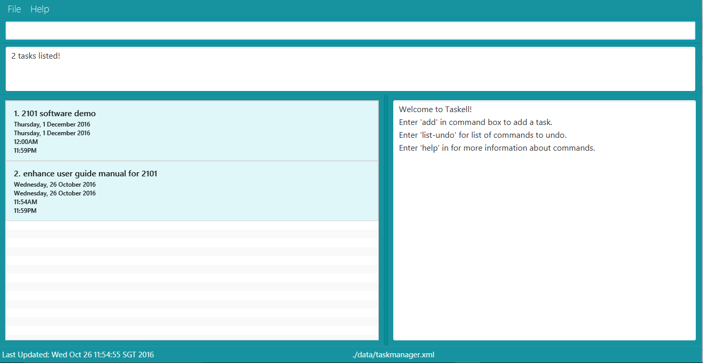

# User Guide
* [Quick Start](#quick-start)
* [Features](#features)
* [FAQ](#faq)
* [Command Summary](#command-summary)

## Quick Start

Step 1: Ensure you have Java version `1.8.0_60` or later installed in your Computer. 
   > Having any Java 8 version is not enough.  
   This application will not work with earlier versions of Java 8.
   
Step 2: Download the latest `taskell.jar` from here.
	 
Step 3: Copy the file to the folder you want to use as the home folder for your Task Manager.
Step 4: Double-click the file to start the application. The GUI should appear in a few seconds.  
   >  
   > Picture 1: A screenshot of the Graphical User Interface (GUI)
Step 5:	Type the relevant command in the command box and press <kbd>Enter<kbd> to execute it.
Step 6: Some example commands you can try:
   * **`list`** : `lists` all contacts
   * **`add`**` buy MA1101R textbook today` : ` adds` a task called buy MA1101R textbook to be done `by` today.
   * **`delete`**` 3` : `deletes` the 3rd task shown in the current list
   * **`exit`** : `exits` the app
6. Refer to the [Features](#features) section below for details of each command. 

## Features

**Command Format**
> * Words in `UPPER_CASE` are the parameters.
> * Items in `SQUARE_BRACKETS` are optional.
> * The parameters have to be in the given order below.

#### Viewing list of commands : `help`

> When unsure of the available commands or command format, <kbd>Enter<kbd> help. If you 
> enter an incorrect command eg. search, the instruction for using each command will be
> displayed as well.
 
 Format: `help`
 
#### Adding a task: `add`
To add a new task to Taskell, use command add. 
Formats: 
- `add TASK ITEM` 
This format can be used to add floating tasks without any deadlines. 
> Example: `add read Harry Potter Book` 
- `add TASK ITEM by [DATE]` 
This format can be used to add events held on a certain day.
> Example: `add buy MA1101R textbook by today` 
> Example: `add do CS2100 assignment by 10th August`
> Example: `add go shopping by tomorrow`
- `add TASK ITEM by [DATE][TIME]` 
This format can be used to add tasks with a stipulated deadline.
> Example: `add do lab homework on Friday 7pm` 
-  `add TASK ITEM on [DATE]` 
> Example: `add schedule meeting on Thursday` 
- `add TASK ITEM on [DATE][TIME]` 
> Example: `add meet teacher on Friday 7pm` 
The use of word “on” gives more flexibility for you. 

* Take Note! Dates need to refer to the current week dates the task was keyed in. Eg.  
* “tomorrow” and “thursday” is valid but “next Saturday” is invalid. Only the words “on”
* or “by” has to be used to distinguish between deadline and task description.

#### Listing all tasks : `list`
To view a list of all the tasks, <kbd>Enter<kbd> list. 
Formats: 
- `list` 
Prints a list of all the uncompleted tasks.
-`list DATE` 
Prints a list of completed tasks.
-`list DONE` 
Prints a list of all the tasks due on the specific date. 
   > 
> Picture 2: List of tasks due today printed when “List today” is keyed in.
   
#### Finding tasks: `find`
To view tasks with similar keyword, use command find. 
Formats: 
-`find KEYWORD [MORE_KEYWORDS]`
Prints a list of activities that match the keywords.
Example:
* `find banana milk essay: returns any task description having keywords banana, milk, essay.`  
-`find-tag KEYWORD `
Prints list of activities with the same tag.
> 
> 
> Picture 3 and 4: Keying in “find report” displays list of tasks with report as one 
> of the keywords in task description

> * Take Note! The order of the keywords does not matter. e.g. `chicken egg` will match `egg chicken`.
> * Full words will be matched e.g. `chicken` will match `chickens`.
> * Tasks matching at least one keyword will be returned (i.e. `OR` search).
    e.g. `chicken` will match `chicken duck`

#### Reverting previous action : `undo`
If you wish to undo your previous action, <kbd>Enter</kbd> undo. 
Format: `undo`

#### Deleting a task : `delete`
To delete a task, use the command delete. This command deletes the task at a specified INDEX. The index refers to the index number shown in the most recent listing. 
Format: `delete INDEX`
 > 
 > 
> Picture 5: Entering delete 1 will delete “Arrange meeting with XYZ company”
Example:
* `find violin, then delete 1: deletes the 1st task in the results of the find command.`

> * Take Note! This action can be reversed via undo, only if no new commands are entered 
> * after deleting.

#### Editing a task : `edit`
To edit a task, use command edit. This command edits the task at a specified INDEX. The index refers to the index number shown in the most recent listing. 
Format: `edit INDEX NEWTASK`
 > 
> Picture 6: edit 2 schedule meeting on wednesday: edits the 2nd task in Taskell to
> “schedule meeting on wednesday”.

#### Saving the information in Taskell
Specify the path of a new folder to store the data file of Taskell. The user should have permissions to access the folder. 

#### Clearing all entries : `clear`
To clear all tasks, <kbd>Enter</kbd> clear. 
Format: `clear`  

#### Exiting the program : `exit`
To close Taskell, <kbd>Enter</kbd> exit. 
Format: `exit`  

>  Done already? So where are all these information saved? No need to worry, Taskell will 
>  have them saved it for you!

## FAQ

**Q**: How do I transfer my data to another Computer? 
**A**: Install the application in the other computer and overwrite the empty data file it creates with the file that contains the data of your previous Taskell folder.
       
## Command Summary

Command | Format  
-------- | :-------- 
Add floating task | `add TASK ITEM `
Add event | `add TASK ITEM by [DATE]`
Add event | `add TASK ITEM by [TIME]`
Add event with deadline | `add TASK ITEM by [DATE][TIME]`
Clear | `clear`
Delete | `delete INDEX`
Find | `find KEYWORD [MORE_KEYWORDS]`
Find tag | `find-tag KEYWORD`
List | `list`
List Given Day | `list [DATE]`
List Tasks Done | `list [DONE]`
Help | `help`
Undo | `undo`
